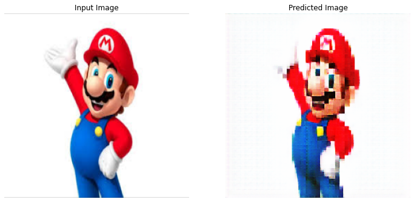
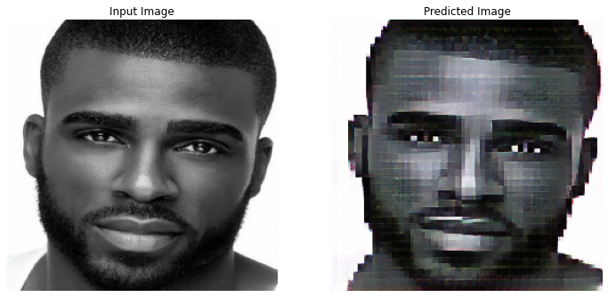
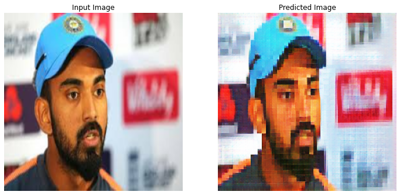
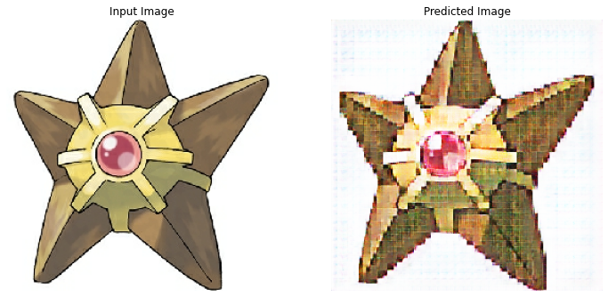
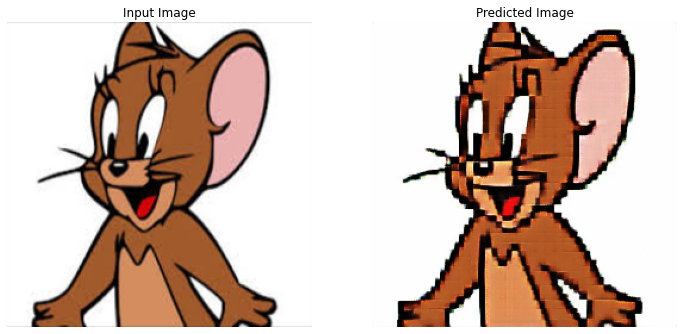

# Project Title : Pixel Art Generation And GameDev On Pixelated Images
#### Pixel arts lets us express more in less, Helps in creating light weight, beautiful applications. CycleGans are used to convert realistic images to pixel art.
#### In this project, a cycleGAN was designed and optimal parameters were found to convert images into pixelated formats. These Pixelated Images were then used to create a 2D platformer game in Unity- Kaggle's Creed

## Datasets
#### Label A :

dataset 1: https://www.kaggle.com/lijiyu/imagenet

dataset 2: https://www.kaggle.com/sarthak4u/aimages

#### Label B:

dataset 1: https://www.kaggle.com/sarthak4u/bimages

dataset 2: https://drive.google.com/file/d/1ko4sGkiIppFH9248_7LVYiyHpzU6OFQp/view?usp=sharing

## Parametrs used for optimal results-  

##### Datasets :

Train :

Label A : https://www.kaggle.com/lijiyu/imagenet

Label B : https://drive.google.com/file/d/1ko4sGkiIppFH9248_7LVYiyHpzU6OFQp/view?usp=sharing

##### Epochs  : 10

##### Lambda (learning rate)  : 2e-4

##### Batch Size : 10 for both the labels (though can be kept different)

## Some Outputs

## Kaggle's Creed
Game Assets were then run through this optimized cycleGAN, and these pixelated assets were then used to create Kaggle's Creed.  

Kaggle's Creed is a 2D platformer game built in Unity for PC. Players spawn in a flat pixelated world as one of the 2 avatars available to pick on the main menu. Three distinctive monsters are spawned on either side of the map and approach the player at varying speeds. The objective of the game is to avoid contact with the monsters by jumping over them.  

Play on Mac- https://drive.google.com/file/d/1tnFIng8ktjO8XBW5__ai_QdNjBdncR-2/view?usp=sharing  
Play on Windows- https://drive.google.com/file/d/1I3mS8Fjd-0BSQTaPEP0DoQQhXd0JdY16/view?usp=sharing  
